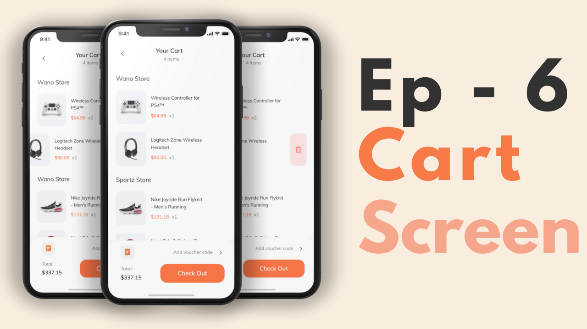

# Tokoto

> flutter tutorial

## [E-Commerce Complate App - Flutter UI](https://github.com/abuanwar072/E-commerce-Complete-Flutter-UI) --  Give the author a :star2: ！ 

## instructions

This is achieved step by step according to the homework, if you are interested you can go directly to the source code.  

## Catalog  

### [Onboarding](doc/Onboarding/README.md)

## Todo  
- [x] Onboarding
- [ ] Login
- [ ] Forgot Password
- [ ] Sign Up
- [ ] Complete Profile
- [ ] OTP Verification
- [ ] Home Page
- [ ] Product Details
- [ ] Order
- [ ] Profile (added)
- [ ] Bottom Navigation Bar (added)

## Photos

