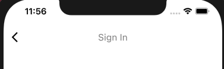
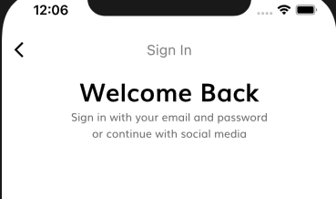

# Login
## Sign In  
```
screens
    - sign_in_screen.dart
```
Create A Sign In Page.
```dart
import 'package:flutter/material.dart';

class SignInScreen extends StatelessWidget {
  static String routeName = "/sign_in";
  @override
  Widget build(BuildContext context) {
    return Scaffold(
      appBar: AppBar(
        title: Text("Sign In"),
      ),
    );
  }
}
```  
router.dart
```dart
import 'package:Tokoto/screens/sign_in/sign_in_screen.dart';
import 'package:Tokoto/screens/splash/splash_screen.dart';
import 'package:flutter/widgets.dart';

final Map<String, WidgetBuilder> routes = {
  SplashScreen.routeName: (context) => SplashScreen(),
  SignInScreen.routeName: (context) => SignInScreen()
};
```  
Click `Continue` to go to the registration page.
screens/splash/components/body.dart
```dart
DefaultButton(
    text: "Continue",
    press: () {
    Navigator.pushNamed(context, SignInScreen.routeName);
    },
),
```  
  

### Welcome to language  
```
screens
    - components
        - body.dart
    - sign_in_screen.dart
```    
body.dart
```dart
import 'package:Tokoto/model/size_config.dart';
import 'package:flutter/material.dart';

class Body extends StatelessWidget {
  @override
  Widget build(BuildContext context) {
    return SafeArea(
      child: SizedBox(
        width: double.infinity,
        child: Column(
          children: <Widget>[
            Text(
              "Welcome Back",
              style: TextStyle(
                  color: Colors.black,
                  fontWeight: FontWeight.bold,
                  fontSize: getProportionateScreenWidth(28)),
            ),
            Text(
              "Sign in with your email and password  \nor continue with social media",
              textAlign: TextAlign.center,
            )
          ],
        ),
      ),
    );
  }
}
```   
sign_in_screen.dart
```dart
 body: Body(),
```  

