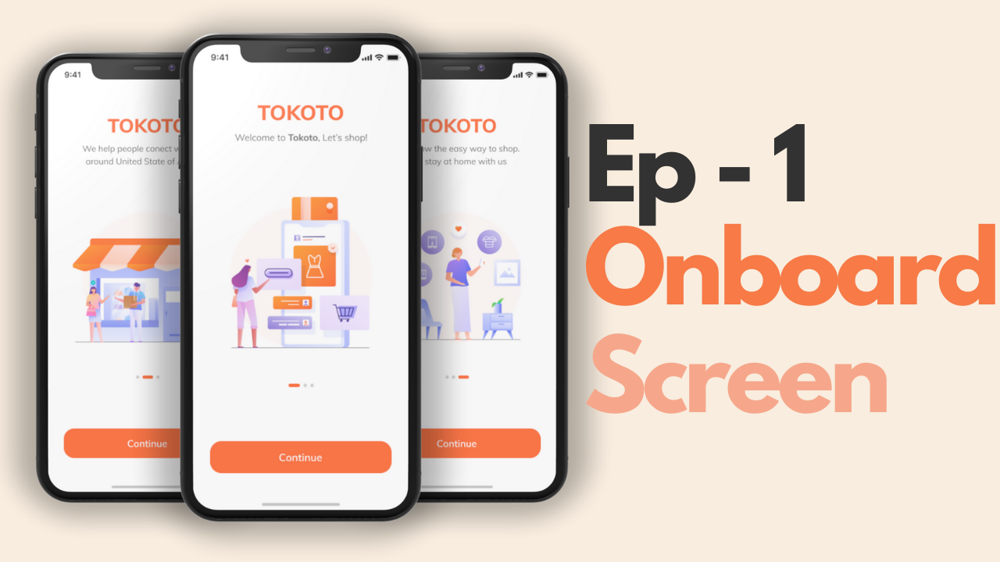
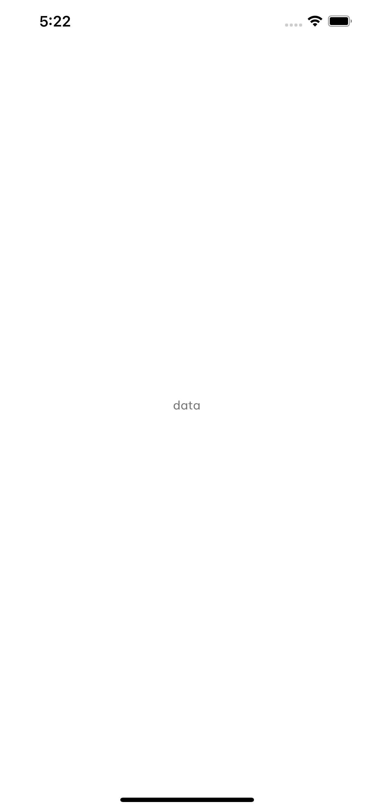
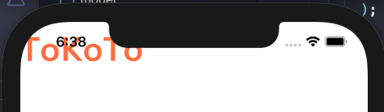
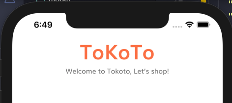
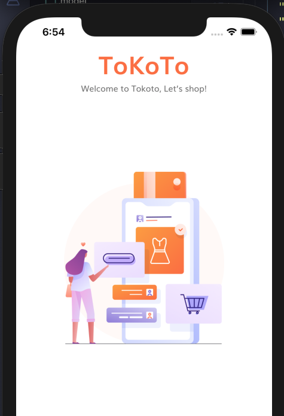

# Onboarding  

  

this is the result! 

## Add Source  

```
- assets  
  - fonts
  - icons
  - images
```  

```yaml
flytter:

  assets:
    - assets/images/
    - assets/icons/

  fonts:
    - family: Muli
      fonts:
        - asset: assets/fonts/muli/Muli.ttf
        - asset: assets/fonts/muli/Muli-Bold.ttf
          weight: 700
        - asset: assets/fonts/muli/Muli-Light.ttf
          weight: 300

```  

## The preset  

```
- lib
  - model
    - constants.dart
    - size_config.dart
  - theme
    - theme.dart
```  

size_config.dart
```dart
import 'package:flutter/material.dart';

class SizeConfig {
  static MediaQueryData _mediaQueryData;
  static double screenWidth;
  static double screenHeight;
  static double defaultSize;
  static Orientation orientation;

  void init(BuildContext context) {
    _mediaQueryData = MediaQuery.of(context);
    screenWidth = _mediaQueryData.size.width; // 屏幕宽（dp）
    screenHeight = _mediaQueryData.size.height; // 屏幕高 (dp)
    orientation = _mediaQueryData.orientation;
  }
}

// Get the proportionate height as per screen size
double getProportionateScreenHeight(double inputHeight) {
  double screenHeight = SizeConfig.screenHeight;
  // 812 is the layout height that designer use
  return (inputHeight / 812.0) * screenHeight;
}

// Get the proportionate height as per screen size
double getProportionateScreenWidth(double inputWidth) {
  double screenWidth = SizeConfig.screenWidth;
  // 375 is the layout width that designer use
  return (inputWidth / 375.0) * screenWidth;
}
```  
constants.dart  
```dart
import 'package:flutter/material.dart';
import 'package:Tokoto/model/size_config.dart';

const kPrimaryColor = Color(0xFFFF7643);
const kPrimaryLightColor = Color(0xFFFFECDF);
const kPrimaryGradientColor = LinearGradient(
  begin: Alignment.topLeft,
  end: Alignment.bottomRight,
  colors: [Color(0xFFFFA53E), Color(0xFFFF7643)],
);
const kSecondaryColor = Color(0xFF979797);
const kTextColor = Color(0xFF757575);

const kAnimationDuration = Duration(milliseconds: 200);

final headingStyle = TextStyle(
  fontSize: getProportionateScreenWidth(28),
  fontWeight: FontWeight.bold,
  color: Colors.black,
  height: 1.5,
);

```  
theme.dart
```dart
import 'package:Tokoto/model/constants.dart';
import 'package:flutter/material.dart';

ThemeData theme() {
  return ThemeData(
      scaffoldBackgroundColor: Colors.white,
      fontFamily: "Muli",
      appBarTheme: appBarTheme(),
      textTheme: textTheme(),
      inputDecorationTheme: inputDecorationTheme(),
      visualDensity: VisualDensity.adaptivePlatformDensity);
}

// Create AppBarTheme
AppBarTheme appBarTheme() {
  return AppBarTheme(
      // 颜色为白色
      color: Colors.white,
      // 下部的影子，该值越大，影子越清楚，为0时，不会有影子，和RaisedButton是一样的
      elevation: 0,
      // 状态栏一般有Brightness.dark,和Brightness.light两种模式,分别是白色的导航栏字体颜色和黑色的字体颜色
      brightness: Brightness.light,
      iconTheme: IconThemeData(color: Colors.black),
      textTheme: TextTheme(
          headline6: TextStyle(color: Color(0XFF8B8B8B), fontSize: 18.0)));
}

// Create TextTheme
TextTheme textTheme() {
  return TextTheme(
      bodyText1: TextStyle(
        color: kTextColor,
      ),
      bodyText2: TextStyle(color: kTextColor));
}

InputDecorationTheme inputDecorationTheme() {
  OutlineInputBorder outlineInputBorder = OutlineInputBorder(
    borderRadius: BorderRadius.circular(28),
    borderSide: BorderSide(color: kTextColor),
    gapPadding: 10,
  );
  return InputDecorationTheme(
    // If  you are using latest version of flutter then lable text and hint text shown like this
    // if you r using flutter less then 1.20.* then maybe this is not working properly
    // if we are define our floatingLabelBehavior in our theme then it's not applayed
    floatingLabelBehavior: FloatingLabelBehavior.always,
    contentPadding: EdgeInsets.symmetric(horizontal: 42, vertical: 20),
    enabledBorder: outlineInputBorder,
    focusedBorder: outlineInputBorder,
    border: outlineInputBorder,
  );
}

```  

## Splash  

```
- lib
  - main.dart
  - model
    - constants.dart
    - size_config.dart
  - theme
    - theme.dart
  - screens
    - splash
      - splash_screen.dart
      - components
        - body.dart
        - splash_content.dart
```  

### SplashScreen  

splash_screen.dart
```dart
import 'package:flutter/material.dart';

class SplashScreen extends StatelessWidget {
  @override
  Widget build(BuildContext context) {
    return Scaffold(
      body: Body(),
    );
  }
}
```  

We need to create a dynamic widget,Because we need to scroll to change the page.  

body.dart
```dart
import 'package:flutter/material.dart';

class Body extends StatefulWidget {
  Body({Key key}) : super(key: key);

  @override
  _BodyState createState() => _BodyState();
}

class _BodyState extends State<Body> {
  @override
  Widget build(BuildContext context) {
    return Container(
      child: Center(
        child: Text("data"),
      ),
    );
  }
}


```  
Let's change the main program and see what happens.  
```dart
import 'package:Tokoto/screens/splash/splash_screen.dart';
import 'package:Tokoto/theme/theme.dart';
import 'package:flutter/material.dart';

void main() {
  runApp(MyApp());
}

class MyApp extends StatelessWidget {
  // This widget is the root of your application.
  @override
  Widget build(BuildContext context) {
    return MaterialApp(
      debugShowCheckedModeBanner: false, // 去除DEBUG标识
      title: 'Flutter Demo',
      theme: theme(),
      home: SplashScreen(),
    );
  }
}

```  

  

## title  

```dart
class _BodyState extends State<Body> {
  @override
  Widget build(BuildContext context) {
    return Column(
      children: <Widget>[
        Expanded(
            flex: 3,
            child: Column(
              children: <Widget>[
                Text(
                  "ToKoTo",
                  style: TextStyle(
                      fontSize: getProportionateScreenWidth(36),
                      color: kPrimaryColor,
                      fontWeight: FontWeight.bold),
                )
              ],
            )),
        Expanded(flex: 2, child: SizedBox())
      ],
    );
  }
}
```  
  

Change to `SafeArea` so that the status bar is automatically removed.
```dart
class _BodyState extends State<Body> {
  @override
  Widget build(BuildContext context) {
    return SafeArea(
      child: Column(
        children: <Widget>[
          Expanded(
              flex: 3,
              child: Column(
                children: <Widget>[
                  Text(
                    "ToKoTo",
                    style: TextStyle(
                        fontSize: getProportionateScreenWidth(36),
                        color: kPrimaryColor,
                        fontWeight: FontWeight.bold),
                  )
                ],
              )),
          Expanded(flex: 2, child: SizedBox())
        ],
      ),
    );
  }
}
```  


```dart
class _BodyState extends State<Body> {
  @override
  Widget build(BuildContext context) {
    return SafeArea(
      child: SizedBox(
        width: double.infinity,
        child: Column(
          children: <Widget>[
            Expanded(
                flex: 3,
                child: Column(
                  children: <Widget>[
                    Text(
                      "ToKoTo",
                      style: TextStyle(
                          fontSize: getProportionateScreenWidth(36),
                          color: kPrimaryColor,
                          fontWeight: FontWeight.bold),
                    ),
                    Text("Welcome to Tokoto, Let’s shop!"),
                  ],
                )),
            Expanded(flex: 2, child: SizedBox())
          ],
        ),
      ),
    );
  }
}

```  

  

Try adding images

```dart
Spacer(),
Image.asset(
  "assets/images/splash_1.png",
  height: getProportionateScreenHeight(265),
  width: getProportionateScreenWidth(235),
)
```  
  

Encapsulate the two parts into a Widget.
```dart
class SplashContent extends StatelessWidget {
  const SplashContent({
    Key key,
  }) : super(key: key);

  @override
  Widget build(BuildContext context) {
    return Column(
      children: <Widget>[
        Spacer(),
        Text(
          "ToKoTo",
          style: TextStyle(
              fontSize: getProportionateScreenWidth(36),
              color: kPrimaryColor,
              fontWeight: FontWeight.bold),
        ),
        Text("Welcome to Tokoto, Let’s shop!"),
        Spacer(
          flex: 2,
        ),
        Image.asset(
          "assets/images/splash_1.png",
          height: getProportionateScreenHeight(265),
          width: getProportionateScreenWidth(235),
        )
      ],
    );
  }
}

```